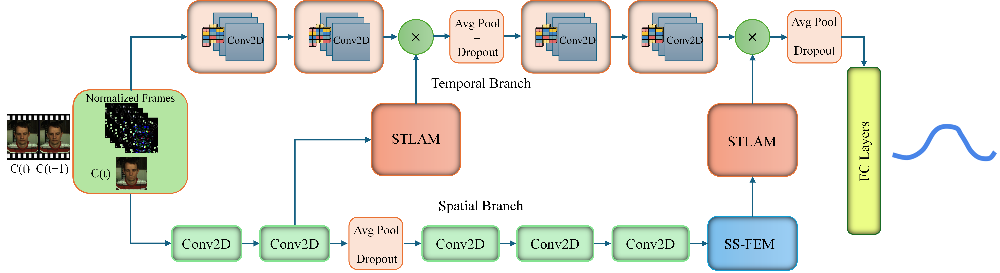

# [STREAM-Net: Spatio-temporal feature fusion network for robust rPPG signal measurement in remote health monitoring](https://doi.org/10.1016/j.knosys.2025.114080) <div align="center">


Muhammad Usman<sup>1</sup> | Milena Sobotka<sup>1</sup> | Jacek Ruminski<sup>1</sup>

<sup>1</sup>Gdansk University of Technology
</div>

## 🚀 Overview

Remote photoplethysmography (rPPG) has become a popular, non-invasive, contactless technique for detecting physiological signals with promising applications. The latest advancements employ deep learning to address the challenges, including motion artifacts, redundancy, and external noise in video-based rPPG signal extraction. To this end, we propose a bilateral spatio-temporal network for estimating blood volume pulse (BVP) signals by analyzing human physiological processes through video frames. The spatio-temporal branches leverage lateral attention and multi-scale feature integration to enhance the extraction of rPPG signals. The spatio-temporal lateral attention module integrates spatial-temporal features at higher and lower resolutions to preserve essential dependency between spatial and temporal data at different scales. Whereas, the multi-scale feature enhancement module encodes high-level features to refine spatial features further with distinct local and global representations. We conducted extensive experiments to validate the effectiveness and superior performance of the proposed method on two benchmark datasets. In cross-dataset validation, STREAM-Net achieved MAE accuracy of 1.151 and RMSE of 2.715 on the UBFC dataset, whereas MAE accuracy of 1.318 and MAPE of 1.384 on the PURE dataset. Cross-dataset testing on both benchmarks demonstrates the efficacy of our proposed approach. Given the importance of repeatability and reliability in clinical measurements, we also quantified predictive uncertainty of our model using Monte Carlo dropout. This analysis exhibited the robust performance and high repeatability of the proposed model, with uncertainty variance ranging from 0.0049 to 0.0113 across different dropout rates.

## 🔥Installation
```
git clone https://github.com/usmanraza121/STREAM-Net.git
cd STREAM-Net
conda create -n rppg python=3.8 pytorch=1.12.1 torchvision=0.13.1 torchaudio=0.12.1 cudatoolkit=10.2 -c pytorch -q -y
pip install -r requirements.txt
```
##  Training and Testing
### Training
```bash
python train.py


